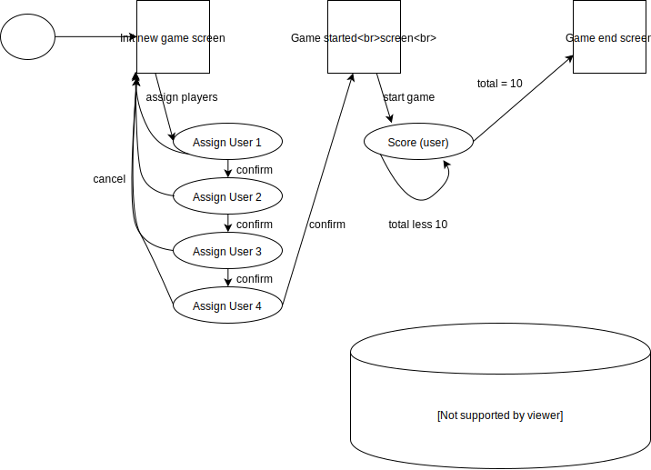

# fossball-game-engine

The fossball game engine (not so intentionally spelled wrong) aims to support in gathering data for a
game of Foosball through hardware keys and nfc reader user management.

The game is written as a hackaton (beware of ugly code) to get to know Raspberry PIs hardware management and
[Qlik Core](https://core.qlik.com/) for analysis and visualizations. 

## Architecture

Hardware components needed
* Raspberry PI v3
* Wires
* Breadboard
* Arcade buttons
* ACR122U nfc card reader 
* Foosball table

## Installation

Apart form getting a new Raspbian image you need to install the following:

* Install Node version 7 for proper ACR122U support.
* ACR122U driver support

`sudo apt-get install libpcsclite1 libpcsclite-dev libudev-dev`

* Install all necessary packages
 
 `npm install` 

* Rename config-example.js to config.js and add your data

* Start Qlik associate engine, local mysql database (dev purpose) and jdbc connector

`ACCEPT_EULA=yes docker-compose up -d`

* Start the service with: 

`npm run start`

